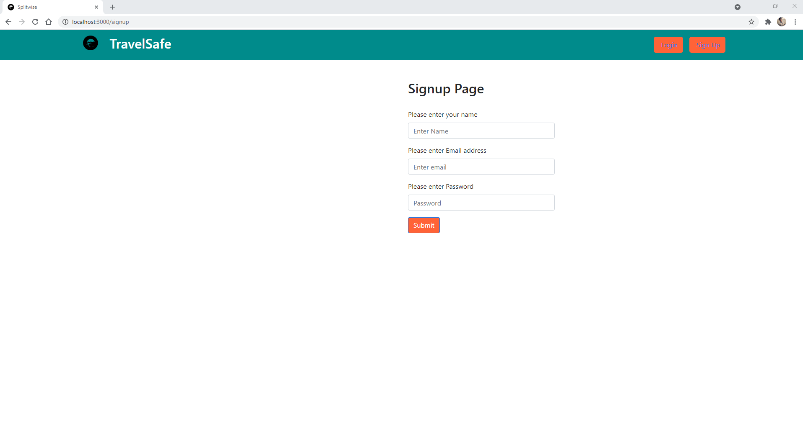

# TravelSafe- Making Pandemic Travel Safer !

**Introduction/ Motivation:**
As the number of cases in different countries continues to fluctuate in an errant manner, changing rules and regulations have made travelers confused and skeptical whether to travel to a particular country or not. Our project aims to simplify and alleviate a prospective traveler concerns by providing a travel score. Analyzing the current number of cases and the status of vaccine distribution in the country the person plans to visit. Our project aims to provide a concise score which can act as a metric to decide whether a destination is safe to travel to or not.

**Abstract/Solution:**
1.	We plan to refine data from various real time COVID datasets which are publicly available to get valuable insights to the current COVID situation.
2.	These insights will be used to create a numerical score for a travel destination.
3.	This score can be further enhanced by the vaccination status of the destination.

**Approach:**
* Input: Travel destination entered by a user (City/State/Country)
* Process: The factors taken into consideration to calculate the score are: 
- 	No. of cases in the that particular area.
- 	No. of people vaccinated in that area.
- 	Population size and density of that area.
* Output: Percentage score showing how safe that destination is.

**Personas:** 
Our target audience would be  uncertain travelers, who cannot decide whether a particular destination is COVID safe or not.

**Datasets:** 
*	https://www.kaggle.com/gpreda/covid-world-vaccination-progress
*	https://www.kaggle.com/imdevskp/corona-virus-report?select=country_wise_latest.csv

## Architecture Diagram

**Landing Page**

**Login Page**

**Signup Page**

**Home Page**

**Top 20 Recommended Safe Countries based on Predicted Score**

**Top 20 Active cases on that date**

## Approach Used
ARIMA model used to predict future number of cases.

## Technologies and tools used:
1. Jupyter Notebook/VS Code : IDE used for coding the solution.
2. Python was used to implement the algorithms. Various predefined libraries
like Sci kit learn, NLTK, Pandas, Numpy etc. were used to perform data
preprocessing, feature engineering etc.
3. React JS and MongoDB were used for building the frontend and backend of
the GUI/ Web Application respectively.
4. Postman was used to test the API.

